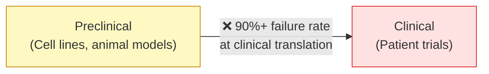
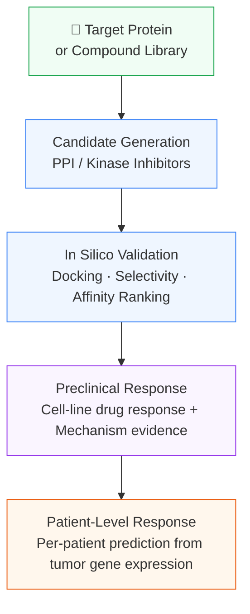
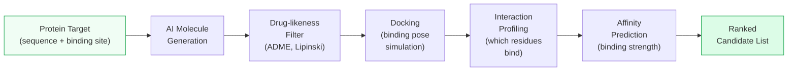
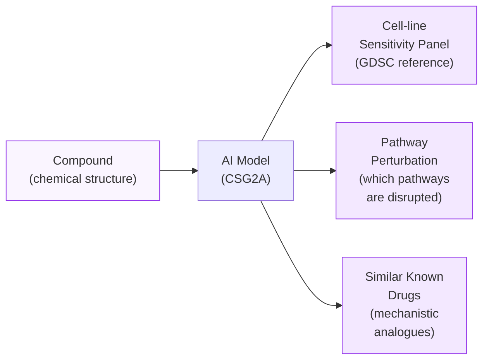
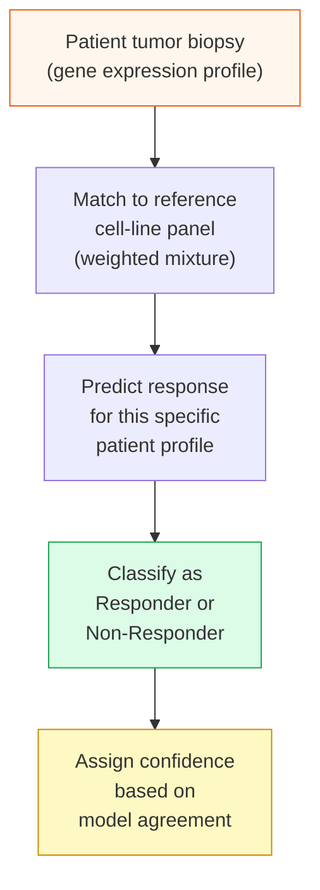
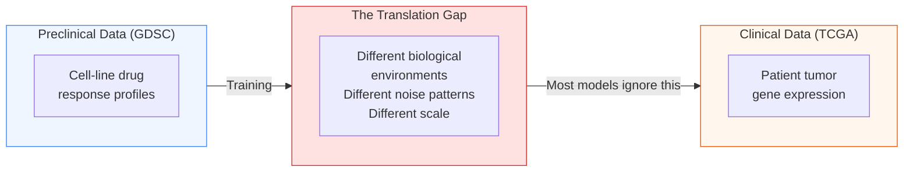
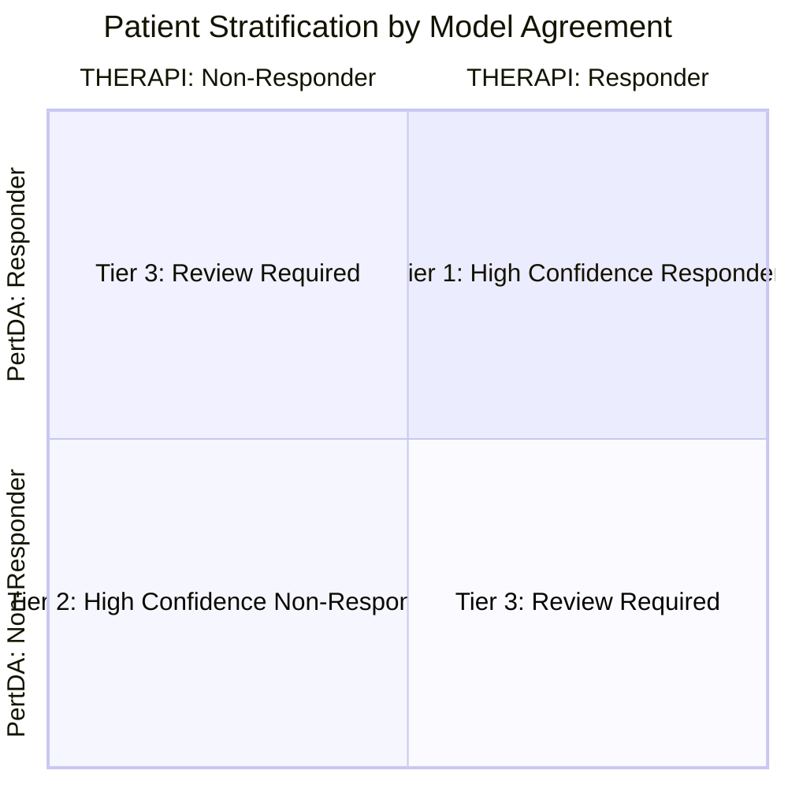
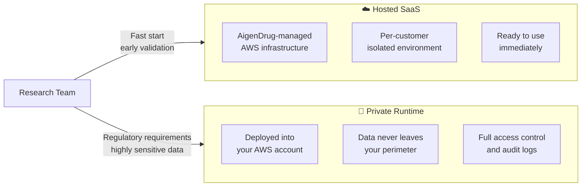
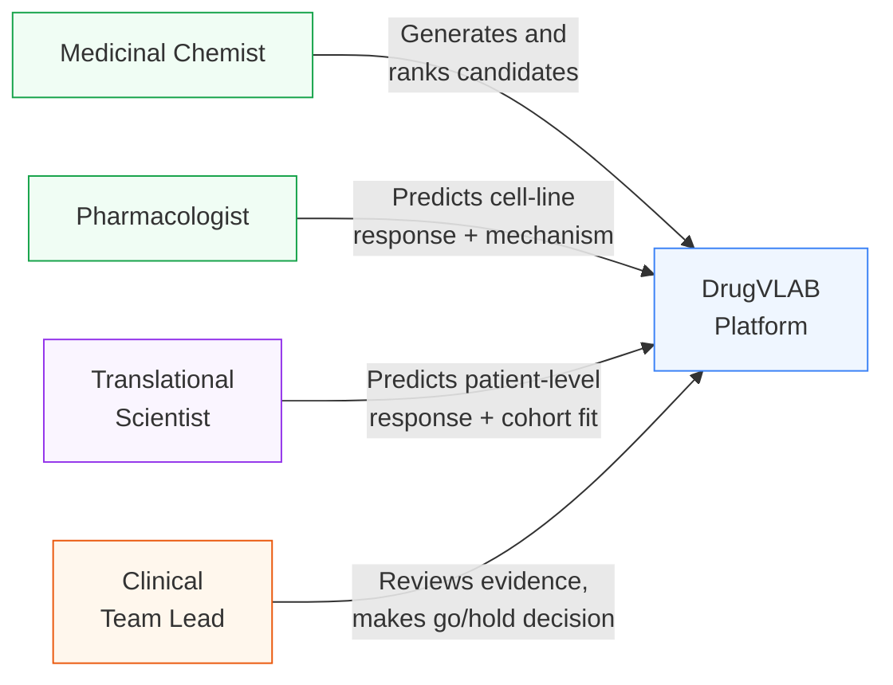
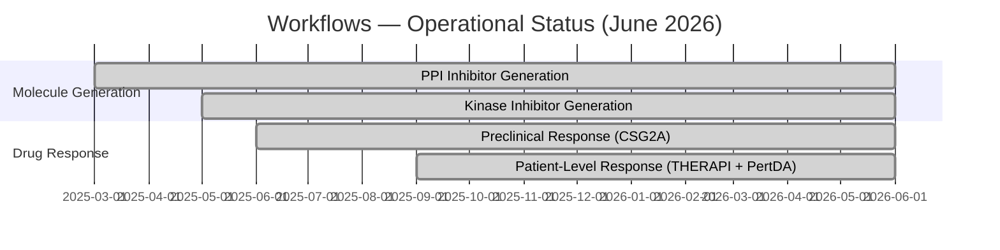

# DrugVLAB
## BIO International Convention 2026 | Meeting Material

---

## Slide 1 — Who We Are

**DrugVLAB** is an AI-powered drug discovery platform built for pharmaceutical, biotech, and clinical research teams.

From candidate generation to patient-level response prediction — the full preclinical and translational drug development workflow on a single platform.

---

## Slide 2 — The Gap We Close

Drug development fails most often at translation — when a promising preclinical result doesn't hold up in patients.

The two sides speak different biological languages. Most AI tools are trained on one side and applied blindly to the other.

DrugVLAB bridges them with models specifically designed for the preclinical-to-clinical translation problem.

---

## Slide 3 — Four Capabilities, One Platform

All four run on the same platform — same interface, same secure environment, same result management.

---

## Slide 4 — Capability 1 & 2: Candidate Generation

### From protein target to ranked compound shortlist

Starting from a protein target, DrugVLAB generates novel small molecule candidates using AI, then filters and ranks them through a full in silico validation pipeline.

**For kinase targets:** The pipeline includes an additional selectivity screen — candidates are also tested against off-target kinases, so the final shortlist is ranked by both potency *and* selectivity.

**What you receive:**
- Ranked candidate list with predicted binding affinity
- Residue-level interaction details (which amino acids each compound contacts)
- Downloadable compound files for synthesis or wet-lab follow-up

---

## Slide 5 — Capability 3: Preclinical Drug Response

### Predicting which cancer cell lines respond — and why

For any candidate compound, DrugVLAB predicts how sensitive or resistant each cancer cell line is, and explains the mechanism behind the prediction.

**Why mechanism matters for your team:**
- "Is this compound acting through the same pathway as drug X?" → answered
- "Which tumor types are most likely sensitive?" → answered
- "What biological process is being disrupted?" → answered

This is not a black-box score. Every prediction comes with biological context.

---

## Slide 6 — Capability 4: Patient-Level Drug Response

### The translational leap — from cell lines to individual patients

This is DrugVLAB's most differentiated capability.

**The problem with standard approaches:**

Most response prediction models are trained on cancer cell lines and applied directly to patient samples. This ignores two fundamental differences:

1. A patient tumor is not a single cell line — it is a mixture of different cell populations with varying drug sensitivities
2. The biological environment of a patient tumor is different from a culture dish

**How DrugVLAB handles this:**

The model does not assume a patient looks like any single cell line. It finds the *combination* of cell-line profiles that best matches the patient's tumor biology, and predicts response from that matched context.

**Input required:** Tumor gene expression data (RNA sequencing, ~978 genes)
**Output:** Response probability per patient, with confidence rating

---

## Slide 7 — The Translation Gap — Solved by Design

DrugVLAB includes a second patient-level model (PertDA) that explicitly addresses the preclinical-to-clinical gap through a technique called domain adaptation.

**The core insight:**

PertDA trains the model to *recognize and correct* this gap during learning — not to ignore it.

**Validated result:** AUROC 0.757 on independent TCGA patient cohort (10-model ensemble)

AUROC 0.757 means: if you randomly pick one responder and one non-responder from the cohort, the model correctly identifies which is which 75.7% of the time.

---

## Slide 8 — Two-Model Confidence Framework

Running both patient-response models on the same cohort produces a stratified confidence structure:

| Tier | What it means | Recommended action |
|---|---|---|
| **Tier 1** | Both models agree: Responder | Prioritize for trial enrollment |
| **Tier 2** | Both models agree: Non-Responder | Deprioritize |
| **Tier 3** | Models disagree | Collect additional biomarker data before deciding |

**Why two models:** A single model's threshold is arbitrary. Agreement between two models with fundamentally different architectures is a meaningful signal.

---

## Slide 9 — Deployment Options

| | **Hosted SaaS** | **Private Runtime** |
|---|---|---|
| Data location | AigenDrug AWS (per-customer isolated) | Your AWS account |
| Time to start | Immediate | Days (Terraform automated) |
| Best for | Early validation, smaller teams | Regulated data, clinical use, enterprise |
| Support | Email | Dedicated CSM + SLA |

---

## Slide 10 — Who Uses DrugVLAB

Each role interacts with the results most relevant to their decision. One platform serves the full drug development team.

---

## Slide 11 — Current Platform Status

All four workflows are **fully operational** on the live platform today.
AWS security certification (Foundational Technical Review) in progress.

---

## Slide 12 — Partnership Opportunities

We are at BIO USA 2026 looking for three types of collaboration:

**1. Pilot Programs**
Bring a cohort of patient samples and a candidate compound. We run patient-level response prediction together and walk through the results. No commitment required.

**2. Co-development Partners**
Oncology-focused biotech or pharma teams with proprietary translational datasets interested in fine-tuning models on their specific tumor types or indications.

**3. Commercial Deployment**
Deploying DrugVLAB inside your AWS environment with full data isolation, dedicated support, and annual licensing.

---

## Slide 13 — Contact

**AigenDrug**

[Contact information]

We are available for 1:1 meetings throughout BIO USA 2026.
Bring your use case — we will show you the platform live.

---

*DrugVLAB — Fully operational as of June 2026*
