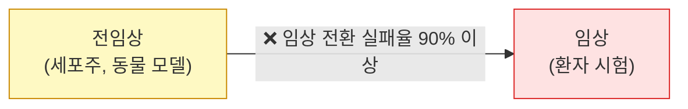
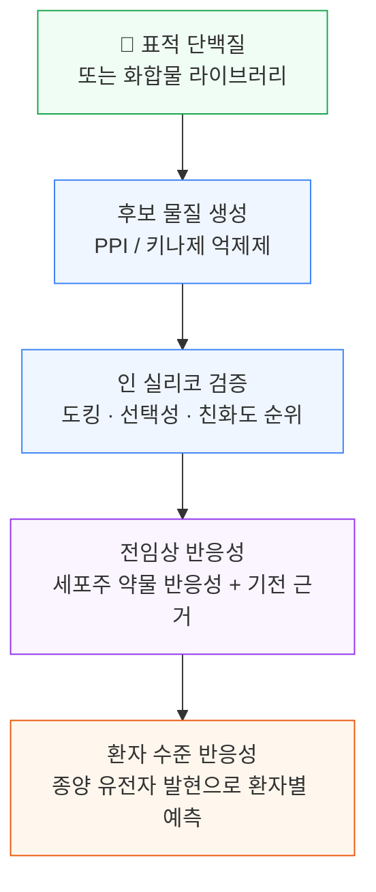
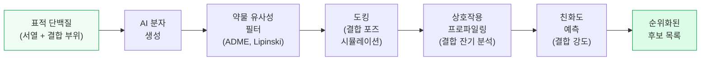
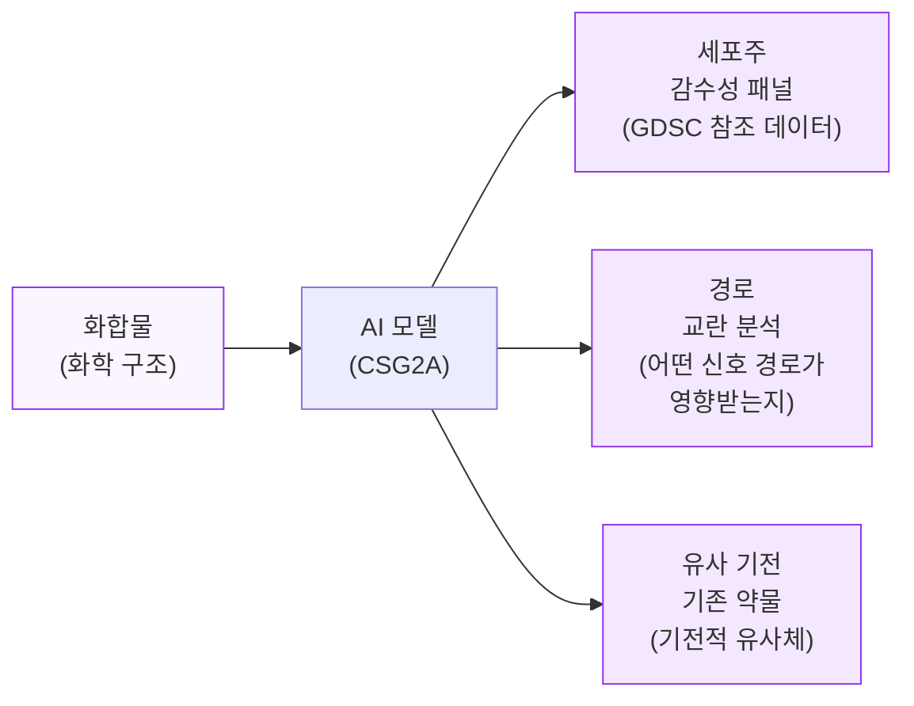
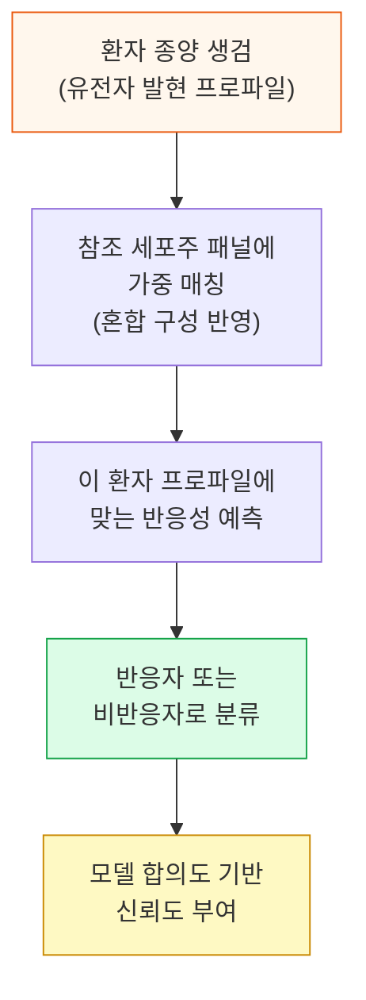
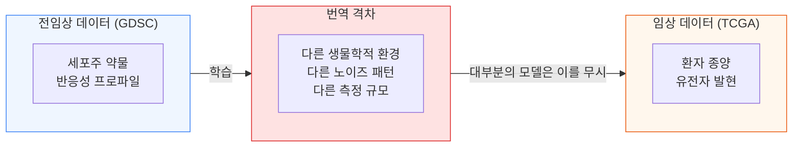
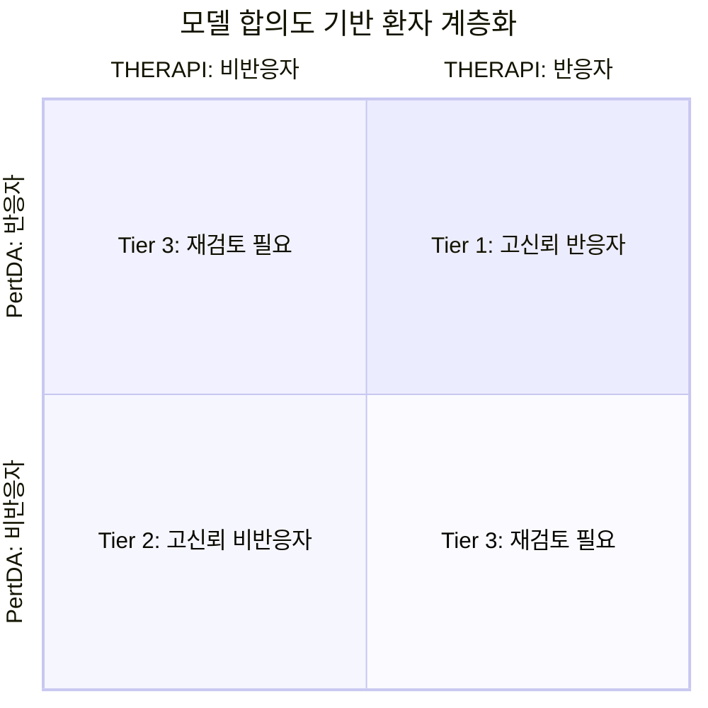
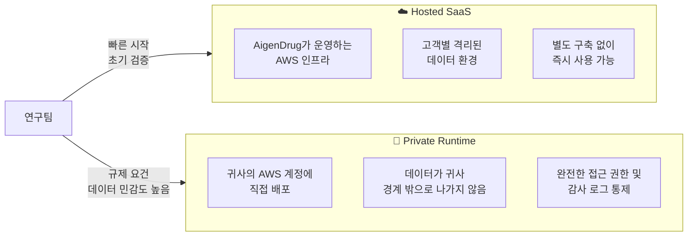
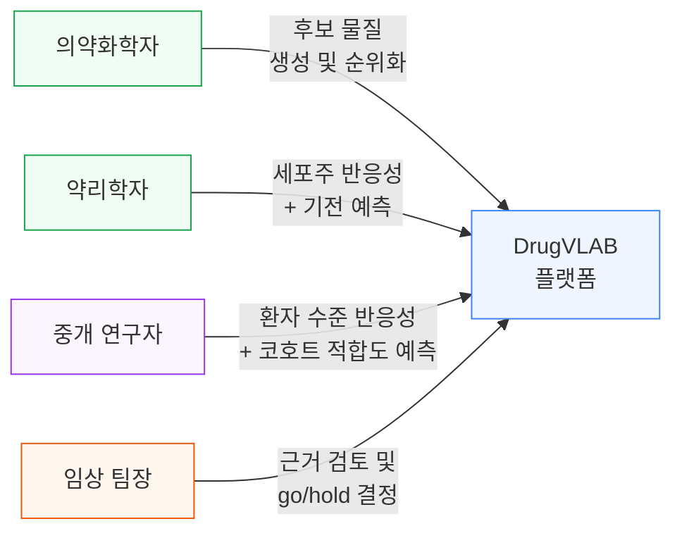
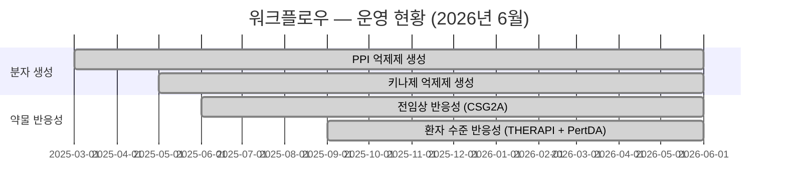

# DrugVLAB
## BIO International Convention 2026 | 미팅 자료

---

## 슬라이드 1 — 우리는 누구인가

**DrugVLAB**은 제약사, 바이오텍, 임상 연구팀을 위한 AI 기반 신약 개발 플랫폼입니다.

후보 물질 생성부터 환자 수준 반응성 예측까지 — 신약 개발의 전임상·중개 단계를 하나의 플랫폼에서 지원합니다.

---

## 슬라이드 2 — 우리가 좁히는 격차

신약 개발 실패의 가장 큰 원인은 번역 실패(translational failure) — 전임상에서 가능성을 보인 물질이 임상에서 효과를 보이지 못하는 현상입니다.

두 환경은 서로 다른 생물학적 언어를 사용합니다. 대부분의 AI 툴은 한쪽 데이터로 학습하고 다른 쪽에 그대로 적용합니다.

DrugVLAB은 전임상-임상 번역 문제를 전용으로 설계된 모델로 이 두 영역을 연결합니다.

---

## 슬라이드 3 — 네 가지 기능, 하나의 플랫폼

네 가지 기능 모두 동일한 플랫폼에서 실행됩니다 — 동일한 인터페이스, 동일한 보안 환경, 동일한 결과 관리.

---

## 슬라이드 4 — 기능 1·2: 후보 물질 생성

### 표적 단백질에서 순위화된 화합물 목록까지

표적 단백질로부터 시작하여 DrugVLAB은 AI로 신규 저분자 후보 물질을 생성하고, 전체 인 실리코 검증 파이프라인을 통해 필터링·순위화합니다.

**키나제 표적의 경우:** 파이프라인에 선택성 스크리닝이 추가됩니다 — 비표적 키나제에 대한 결합도 함께 평가하여, 최종 목록은 효능과 선택성을 모두 고려해 순위화됩니다.

**결과물:**
- 예측 결합 친화도 포함 후보 물질 순위 목록
- 잔기 수준 상호작용 상세 정보 (각 화합물이 접촉하는 아미노산)
- 합성 또는 실험 후속을 위한 화합물 파일 다운로드

---

## 슬라이드 5 — 기능 3: 전임상 약물 반응성

### 어떤 암세포주가 반응하는지 — 그리고 왜 반응하는지 예측

임의의 후보 화합물에 대해 DrugVLAB은 각 암세포주의 감수성 또는 내성을 예측하고, 예측 근거가 되는 기전을 설명합니다.

**기전 정보가 중요한 이유:**
- "이 화합물이 기존 약물 X와 같은 경로로 작용하는가?" → 답변 가능
- "어떤 종양 유형이 가장 민감하게 반응할 가능성이 높은가?" → 답변 가능
- "어떤 생물학적 과정이 교란되는가?" → 답변 가능

블랙박스 점수가 아닙니다. 모든 예측에는 생물학적 맥락이 함께 제공됩니다.

---

## 슬라이드 6 — 기능 4: 환자 수준 약물 반응성

### 번역의 도약 — 세포주에서 개별 환자로

이것이 DrugVLAB의 가장 차별화된 기능입니다.

**기존 접근 방식의 문제:**

대부분의 반응성 예측 모델은 암세포주로 학습하고 환자 샘플에 그대로 적용합니다. 이는 두 가지 근본적인 차이를 무시합니다:

1. 환자 종양은 단일 세포주가 아닙니다 — 서로 다른 약물 감수성을 가진 다양한 세포 집단의 혼합체입니다
2. 환자 종양의 생물학적 환경은 배양 접시와 다릅니다

**DrugVLAB의 접근 방식:**

모델은 환자가 특정 세포주 하나와 동일하다고 가정하지 않습니다. 환자의 종양 생물학에 가장 잘 맞는 세포주 프로파일의 *조합*을 찾아, 그 맥락에서 반응성을 예측합니다.

**필요한 입력:** 종양 유전자 발현 데이터 (RNA 시퀀싱, ~978개 유전자)  
**출력:** 환자별 반응 확률 및 신뢰도 등급

---

## 슬라이드 7 — 번역 격차 — 설계로 해결

DrugVLAB에는 두 번째 환자 수준 모델(PertDA)이 포함되어 있으며, 이 모델은 도메인 적응(domain adaptation)이라는 방법으로 전임상-임상 격차를 명시적으로 해결합니다.

**핵심 통찰:**

PertDA는 학습 과정에서 이 격차를 *인식하고 보정*하도록 훈련됩니다 — 무시하는 것이 아니라.

**검증 결과:** 독립적인 TCGA 환자 코호트에서 AUROC 0.757 (10개 모델 앙상블)

AUROC 0.757의 의미: 코호트에서 반응자 1명과 비반응자 1명을 무작위로 선택했을 때, 모델이 어느 쪽이 반응자인지 75.7%의 확률로 정확하게 구별합니다.

---

## 슬라이드 8 — 2모델 신뢰도 프레임워크

동일한 코호트에 두 환자 반응성 모델을 모두 적용하면 계층화된 신뢰도 구조가 만들어집니다:

| 등급 | 의미 | 권장 조치 |
|---|---|---|
| **Tier 1** | 두 모델 모두 반응자 판정 | 임상시험 등록 우선 고려 |
| **Tier 2** | 두 모델 모두 비반응자 판정 | 우선순위 하향 |
| **Tier 3** | 두 모델 불일치 | 결정 전 추가 바이오마커 데이터 수집 |

**두 모델을 사용하는 이유:** 단일 모델의 기준값(threshold)은 자의적입니다. 근본적으로 다른 구조를 가진 두 모델의 합의는 의미 있는 신호입니다.

---

## 슬라이드 9 — 배포 옵션: 두 가지 방식으로 사용 가능

| | **Hosted SaaS** | **Private Runtime** |
|---|---|---|
| 데이터 위치 | AigenDrug AWS (고객별 격리) | 귀사 AWS 계정 내 |
| 구축 기간 | 즉시 | 수일 (Terraform 자동화) |
| 적합한 경우 | 초기 검증, 소규모 팀 | 규제 요건, 임상 데이터, 대규모 운영 |
| 지원 | 이메일 | 전담 매니저 + SLA |

---

## 슬라이드 10 — DrugVLAB을 사용하는 사람들

각 역할은 자신의 의사결정에 가장 관련 있는 결과를 확인합니다. 하나의 플랫폼이 신약 개발팀 전체를 지원합니다.

---

## 슬라이드 11 — 현재 플랫폼 운영 현황

네 가지 워크플로우 모두 현재 라이브 플랫폼에서 **완전 운영 중**입니다.  
AWS 보안 인증(Foundational Technical Review) 진행 중.

---

## 슬라이드 12 — 파트너십 기회

저희는 BIO USA 2026에서 세 가지 형태의 협력을 모색하고 있습니다:

**1. 파일럿 프로그램**  
환자 샘플 코호트와 후보 화합물을 가져오세요. 함께 환자 수준 반응성 예측을 실행하고 결과를 검토합니다. 별도의 계약 의무 없이 진행합니다.

**2. 공동 개발 파트너**  
특정 종양 유형이나 적응증에 대해 자체 중개 데이터셋을 보유한 종양학 중심의 바이오텍 또는 제약사로, 모델 파인튜닝에 관심 있는 팀.

**3. 상업적 배포**  
완전한 데이터 격리, 전담 지원, 연간 라이선스와 함께 귀사의 AWS 환경 내에 DrugVLAB을 배포합니다.

---

## 슬라이드 13 — 연락처

**AigenDrug**

[연락처 정보]

BIO USA 2026 기간 내내 1:1 미팅이 가능합니다.  
귀사의 활용 사례를 가져오세요 — 플랫폼을 직접 보여드리겠습니다.

---

*DrugVLAB — 2026년 6월 기준 완전 운영 중*
