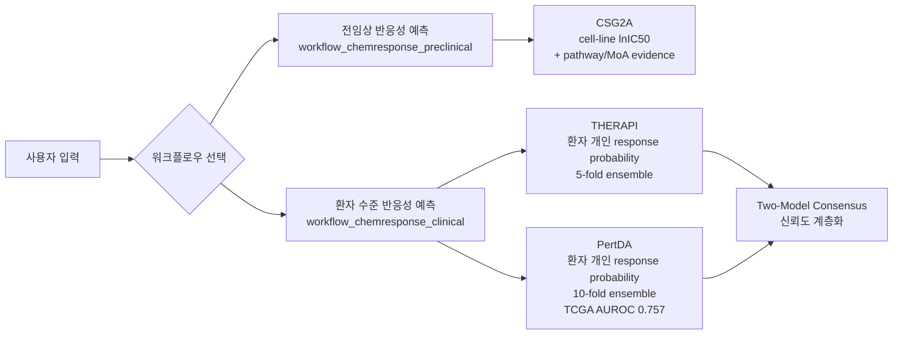
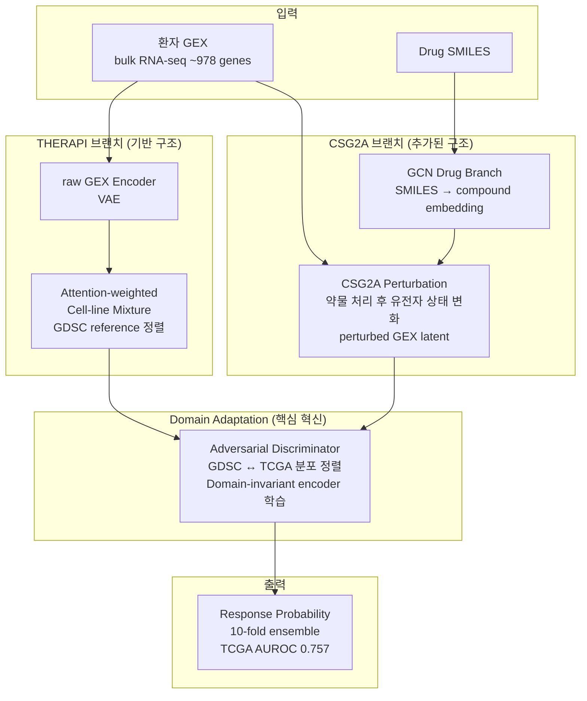
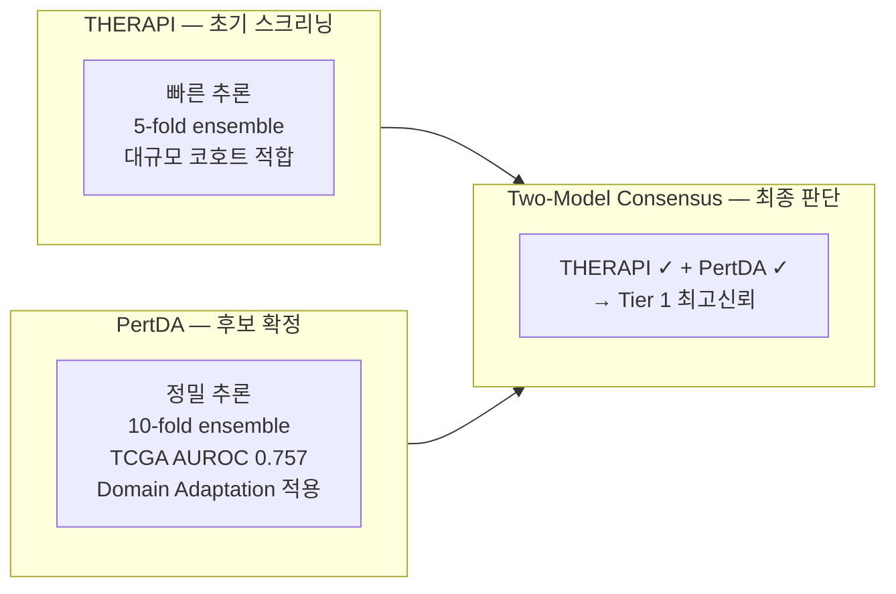
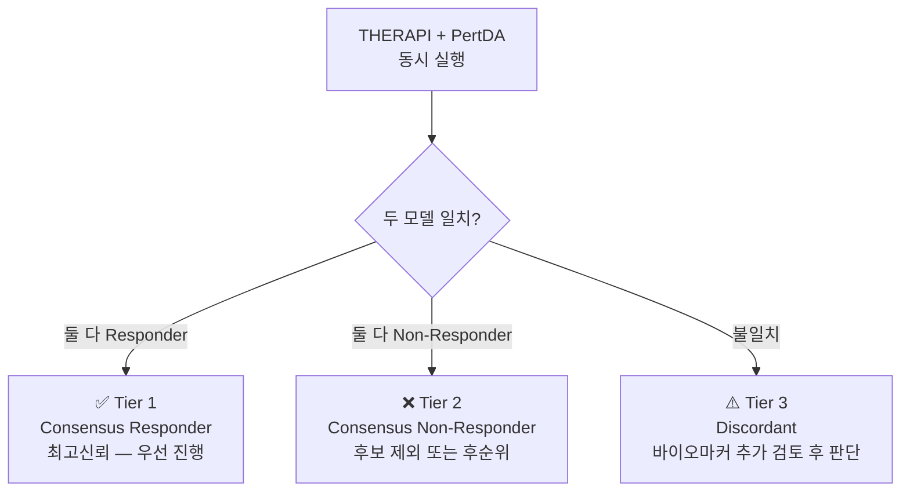
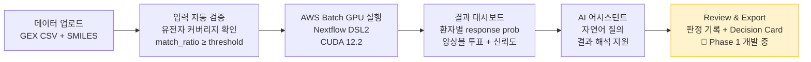
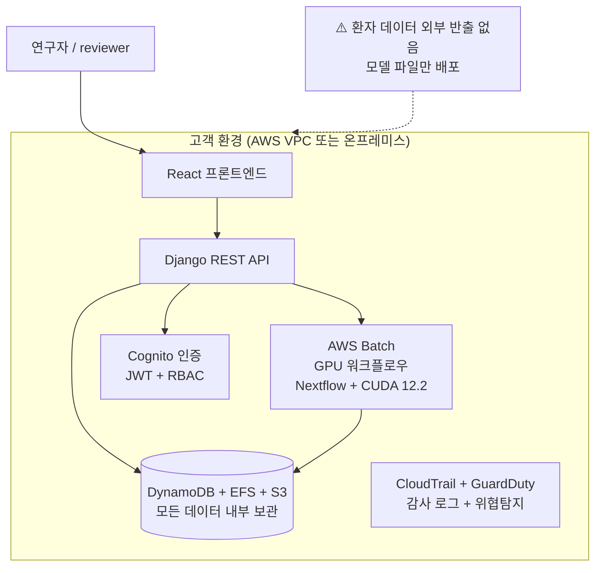
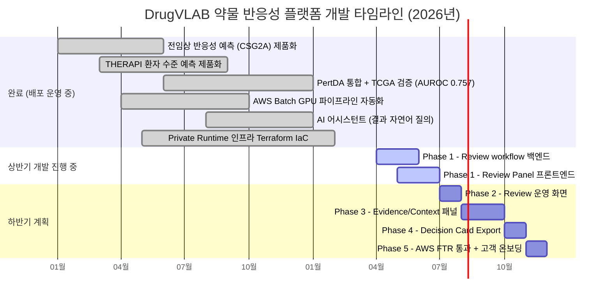
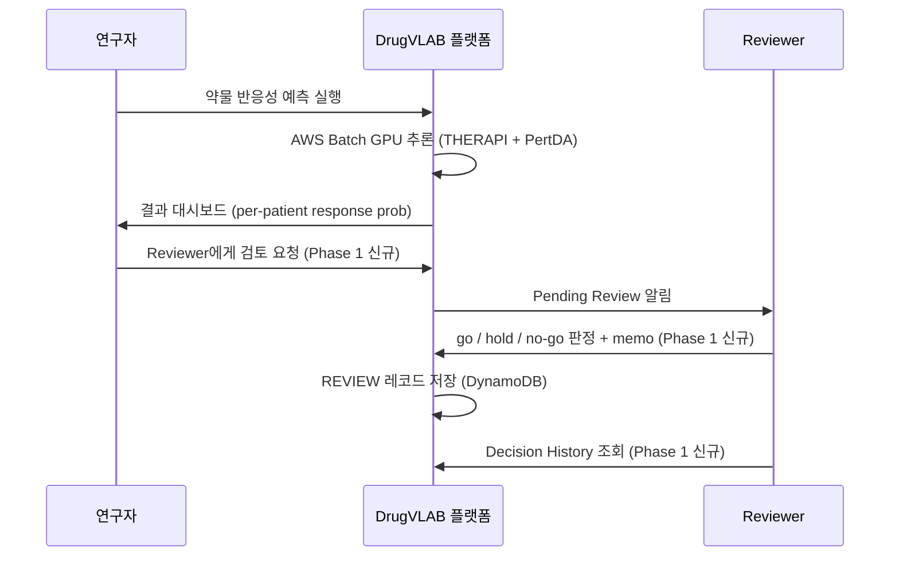

# 약물 반응성 예측 AI 플랫폼 개발 진척도 보고서
**산업통상자원부 과제 — 2026년 상반기 성과 보고**
작성일: 2026년 5월 21일 | 작성: 플랫폼팀

---

## 1. 제품 개요

DrugVLAB은 제약사·병원·바이오텍의 내부 데이터 환경에서 실행되며,
**약물 반응성 예측 결과를 검토 가능한 evidence package로 묶어 의사결정을 표준화하는 translational decision-support SaaS**다.

환자 데이터를 외부 서버로 반출하지 않고 고객 환경 내부에서 AI 추론을 완결하는 **Private Runtime 구조**가 핵심 차별화 요소다.

---

## 2. 상반기 대표 성과 — 약물 반응성 예측 모듈 완전 제품화

### 2-1. 운영 중인 약물 반응성 워크플로우



| 워크플로우 | 입력 | 핵심 모델 | 출력 |
|---|---|---|---|
| 전임상 반응성 | Drug SMILES | CSG2A | cell-line panel lnIC50 + pathway perturbation + MoA similarity |
| 임상(환자) 반응성 | 환자 GEX + Drug SMILES | THERAPI + **PertDA** | 환자 개인별 반응 확률 + 앙상블 신뢰도 |

---

### 2-2. 핵심 모델 아키텍처 — PertDA (대표 성과)

> **"cell-line에서 잘 되던 약이 환자에게 안 된다"는 translational failure 문제를 모델 아키텍처 레벨에서 직접 해결한 국내 최초 수준의 제품화 모델**



**PertDA가 THERAPI 대비 추가로 해결하는 문제:**

| 기술 요소 | 해결하는 문제 | 세일즈 언어 |
|---|---|---|
| CSG2A 결합 | 약물 SMILES만 보는 게 아니라, 약이 환자 유전자를 실제로 어떻게 바꾸는지 반영 | "약물의 perturbation 효과까지 통합한 예측" |
| Domain Adaptation (adversarial) | GDSC(전임상)와 TCGA(환자) 간 분포 갭을 명시적으로 좁힘 | "전임상→임상 도메인 갭을 모델 학습 단계에서 직접 다룸" |
| 10-fold ensemble | 5-fold → 10-fold로 앙상블 안정성 향상 | "10개 모델 투표로 예측 불확실성 정량화" |

**검증 성능:**

```
AUROC (TCGA 외부 검증): 0.757
표준편차:               0.032
앙상블 체크포인트:       10-fold
학습 데이터:            GDSC (cell-line, 전임상)
검증 데이터:            TCGA (환자, 임상)  ← 완전히 독립된 외부 코호트
```

---

### 2-3. THERAPI vs PertDA — 두 모델 비교



| | THERAPI | PertDA |
|---|---|---|
| 환자 GEX 인코딩 | raw GEX encoder (VAE) | 동일 |
| 약물 표현 | GCN (SMILES graph) | GCN + **CSG2A compound embedding** |
| 세포 상태 표현 | raw GEX latent | raw GEX latent + **CSG2A perturbed GEX latent** |
| Domain shift 처리 | 없음 | **적대적 학습 (raw GEX DA + CSG2A-state DA)** |
| 앙상블 | 5-fold | **10-fold** |
| TCGA AUROC | — | **0.757** |
| 권장 사용 시나리오 | 대규모 초기 스크리닝 | 전임상→임상 신뢰도가 중요한 후보 확정 |

---

### 2-4. Two-Model Consensus — 계층적 신뢰도 프레임워크

THERAPI와 PertDA를 동시에 실행하면 두 독립 모델의 동의 여부로 신뢰도를 계층화할 수 있다.



| Tier | 조건 | 의미 | 권장 액션 |
|---|---|---|---|
| **Tier 1** | THERAPI ✓ + PertDA ✓ | Consensus Responder | 임상시험 등록 우선 검토 / 다음 실험 우선 진행 |
| **Tier 2** | THERAPI ✗ + PertDA ✗ | Consensus Non-Responder | 후보 제외 또는 후순위 |
| **Tier 3** | 불일치 | 모델 간 의견 불일치 | 바이오마커 추가 검토 후 판단 |

> **의사결정자 메시지**: 단일 임계값이 아닌, 두 독립 모델이 동의할 때만 고신뢰로 분류한다. 임계값 조작 없이 불확실성을 구조적으로 표현한다.

---

### 2-5. 제품화 완성 수준 — end-to-end 플랫폼

약물 반응성 예측은 모델 코드에 그치지 않고 아래 전체 흐름이 제품으로 완성되어 있다:



---

## 3. 인프라 및 보안 — Private Runtime 구조



| 보안 요소 | 구현 내용 |
|---|---|
| 데이터 잔류 | 모든 환자 GEX, 예측 결과 — 고객 환경 내 보관 |
| 인증 | AWS Cognito JWT, 역할 기반 접근제어 (researcher / reviewer / admin) |
| 암호화 | KMS (비밀정보), HTTPS/TLS (전송), EFS 저장 암호화 |
| 감사 | CloudTrail (전체 API 호출), 활동 로그 DynamoDB 기록 |
| 인프라 | Terraform IaC 6개 모듈 완성 (버전 관리, 재현 가능 배포) |
| 진행 중 | **AWS FTR(Foundational Technical Review)** — enterprise 계약 전제조건 |

---

## 4. 개발 타임라인 — 상반기 진행 현황



---

## 5. 향후 계획

### 5-1. 단기 (상반기 완료 목표)

**Phase 1 — Review Workflow 완성 (현재 개발 중)**



완료 기준: reviewer가 결과 화면에서 판정을 저장하고, 이력을 조회할 수 있다.

### 5-2. 하반기 계획 요약

| Phase | 시기 | 목표 | 의미 |
|---|---|---|---|
| Phase 2 | 7–8월 | Review 운영 화면 (Pending 목록 / Decision History) | reviewer 일상 업무 흐름 시스템화 |
| Phase 3 | 8–10월 | Evidence/Context 패널 — Recommendation Card + MoA 근거 한 화면 통합 | "분석 결과 dump" → "검토 가능한 근거 패키지"로 전환 |
| Phase 4 | 10–11월 | Decision Card Export (JSON → PDF) | 회의 자료 1클릭 생성 |
| Phase 5 | 11–12월 | **AWS FTR 통과 + 첫 enterprise 고객 온보딩** | 실질 매출 전환점 |

### 5-3. 연구 확장 계획 (분과장 역할 포함)

현재 PertDA의 외부 검증은 TCGA(범암종) 기준이며, 하반기 이후 다음 방향으로 연구 연속성을 확보할 수 있다:

| 방향 | 내용 | 기대 효과 |
|---|---|---|
| 추가 외부 코호트 검증 | TCGA 외 독립 코호트 (예: METABRIC, ICGC) 적용 | AUROC 0.757의 일반화 근거 강화 |
| 암종 특이적 미세조정 | 유방암, 폐암 등 암종별 fine-tuning | 특정 적응증 고객 대상 정밀도 향상 |
| single-cell 입력 확장 | bulk RNA-seq → scRNA-seq 지원 | 종양 내 이질성 해석 정밀도 향상 |
| 바이오마커 발굴 연동 | Tier 3 (불일치) 샘플의 차별 유전자 분석 | 반응군/비반응군 바이오마커 후보 자동 제시 |

---

## 6. 부족한 부분 및 대응 방안

| 부족한 부분 | 현황 | 대응 방안 |
|---|---|---|
| Review workflow 미완성 | Phase 1 개발 중 | 상반기 내 완료 → 즉시 파일럿 고객 POC 가능 상태 전환 |
| AWS FTR 미취득 | 진행 중 | Phase 5 (11월) 목표, FTR 통과 = enterprise 계약 실행 조건 완비 |
| 외부 코호트 검증 단일 | TCGA만 검증 | 하반기 추가 코호트 적용으로 일반화 근거 보강 |
| 암종 특이적 성능 미검증 | 범암종 모델 | 주요 적응증(유방암·폐암) 특화 검증 착수 계획 |

---

## 요약

**상반기 핵심 성과 한 줄:**
> 환자 유전자 발현 데이터만으로 개인 수준 약물 반응성을 예측하는 PertDA 모델을 TCGA 외부 검증(AUROC 0.757) 완료하고, AWS Batch GPU 파이프라인·결과 대시보드·AI 어시스턴트까지 포함한 end-to-end 제품으로 배포 운영 중이다.

**하반기 목표 한 줄:**
> Review workflow 완성 → Evidence 패널 → Decision Card Export → AWS FTR 통과의 순서로 "결과 확인에서 회의 자료 생성까지" 연결된 운영 흐름을 완성하고, 첫 enterprise 고객 온보딩을 실현한다.
