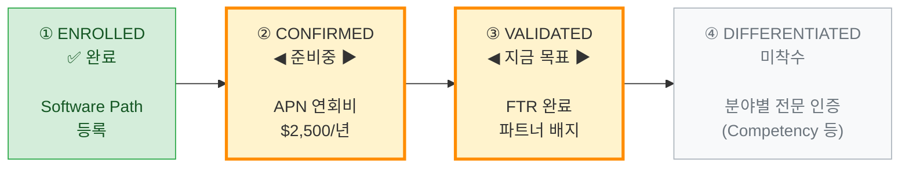
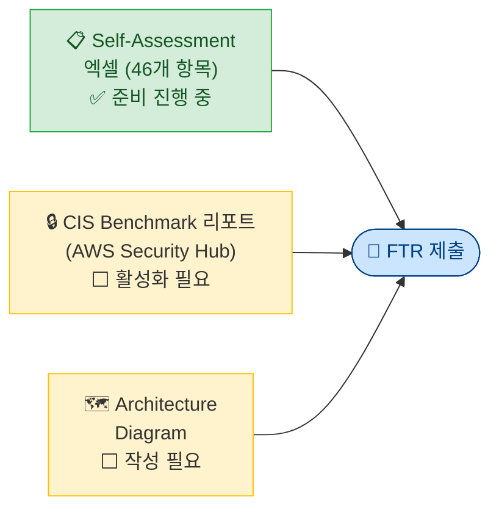
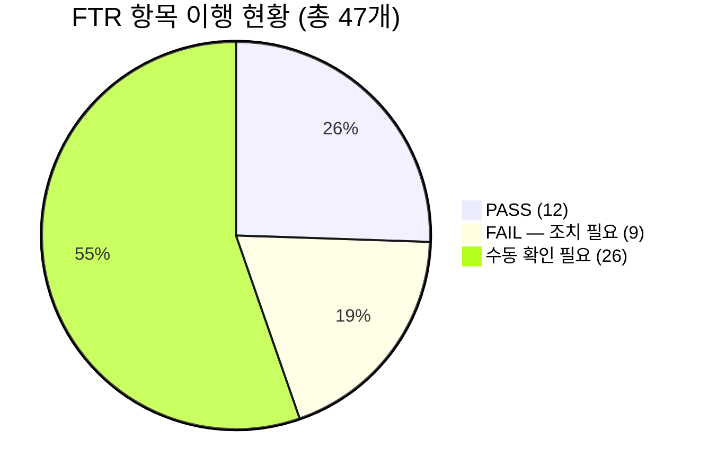
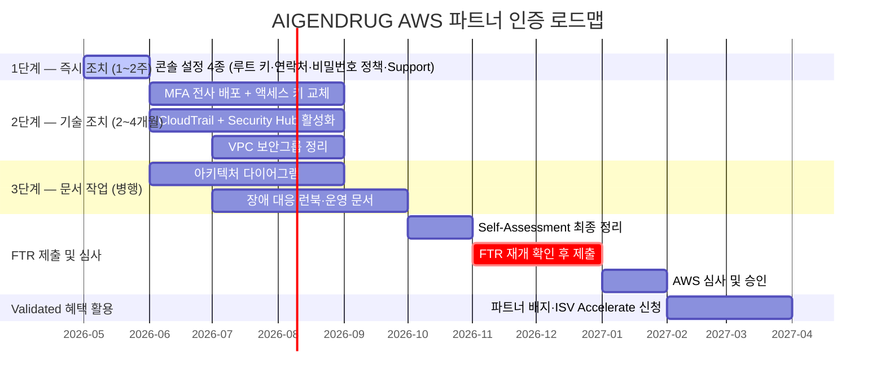

# AWS 파트너 인증 전략 로드맵

> **대상**: AIGENDRUG Co., Ltd. | **작성일**: 2026년 5월  
> **현재 단계**: Enrolled 완료 → **Validated(FTR) self-test 진행중**  

---

## 왜 AWS 파트너 인증인가?

| # | 이유 | 설명 |
|---|---|---|
| 1 | **AWS가 우리 제품을 대신 팔아준다** | AWS 영업 담당자(AM)가 고객에게 AIGENDRUG 솔루션을 직접 추천 |
| 2 | **글로벌 검색에 공식 노출** | AWS.com 파트너 디렉토리 등재 → 전 세계 기업 고객이 검색 시 AIGENDRUG 노출 |
| 3 | **기술 신뢰도 공식 인증** | FTR은 보안·안정성·운영 표준을 검증하는 AWS 공식 심사 → 대기업·제약사 납품 시 계약 장벽 낮춤 |

---

## AWS 인증이 기술력을 사업 성과로 연결하는 방법

> AIGENDRUG의 핵심 경쟁력은 **기술과 연구**. AWS 파트너 인증은 이 기술력을 글로벌 시장에서 **영업·마케팅·신뢰도로 전환**해주는 외부 인프라.

### ① 기술력을 영업 채널로 전환

| AWS가 제공하는 것 | 효과 |
|---|---|
| ISV Accelerate (공동 영업 프로그램) — AWS 영업 담당자가 맞춤 견적을 고객에게 직접 제안 | 인증 파트너의 51% 매출 성장, 65% 더 빠른 계약 체결 |
| 파트너 검색 디렉토리 (Partner Solution Finder) 등재 | 별도 마케팅 비용 없이 글로벌 노출 |
| AWS 영업 담당자 인센티브 구조 | 담당자가 AIGENDRUG를 **적극적으로 추천할 동기** 생김 |

* ISV - Independent Software Vendor 

### ② 기술 신뢰도를 공식 인증으로 가시화

| AWS가 제공하는 것 | 효과 |
|---|---|
| FTR 인증서 — 보안·안정성 46개 항목 통과 증명 | AWS 기반 솔루션의 보안 수준을 공식 문서로 입증 → 대기업·제약사 벤더 심사 시 신뢰도 자료로 활용 가능 |
| "AWS Validated Partner" 공식 지위 | 대기업 고객의 벤더 심사 장벽 낮춤 |
| AWS Partner Badge | 제안서·웹사이트에 표시 → 초기 신뢰 형성 가속 |

### ③ 마케팅·사업 확장 비용을 AWS와 분담

| AWS가 제공하는 것 | 효과 |
|---|---|
| MDF — 콘텐츠 제작, 웨비나, 이벤트 비용 지원 | 자체 마케팅 예산 절감 |
| POA 지원금 — 파일럿(PoC) 비용 지원 | 대형 계약 진입 비용 부담 경감 |
| AWS 공식 블로그·보도자료 공동 발행 | AWS 브랜드와 함께 기술력 대외 홍보 |
| AWS Global Sponsorship — re:Invent 등 글로벌 행사 참여 | 글로벌 네트워킹 및 브랜드 노출 |

---

## 전체 단계 한눈에 보기

---

## STAGE 3 — Validated (지금 목표)

**FTR**: AWS가 보안·안정성·운영 자동화 등 46개 항목을 직접 심사. 통과 시 "AWS Validated Partner" 지위 획득.

### FTR 제출 서류 3종

* Center for Internet Security  
인터넷 보안 분야 비영리 국제 기관. 이 기관이 만든 CIS Benchmark는 AWS 계정 보안 설정 기준을 정의한 국제 표준 가이드라인이고, AWS Security Hub가 이 기준에 맞춰 자동으로 계정을 점검해서 리포트를 생성

---

## 현재 준비 상태 (2026-04-29 기준)

### ❌ 조치 필요한 9개 항목

| # | 항목 | 내용 | 예상 소요 |
|---|---|---|---|
| ① | 루트 액세스 키 삭제 | IAM 콘솔에서 즉시 삭제 | **1일** |
| ② | AWS 계정 연락처 3종 설정 | 청구·운영·보안 담당자 연락처 미설정 | **1일** |
| ③ | IAM 비밀번호 정책 설정 | 14자 이상, 재사용 방지 | **1일** |
| ④ | AWS Business Support 구독 | Basic → Business 업그레이드 (월 $100~) | **1일** |
| ⑤ | IAM 사용자 MFA 설정 | MFA 미설정 5명 개별 설정 | 1~2주 |
| ⑥ | IAM 액세스 키 교체 | 90일 초과 8개, 일부 1,000일 이상 미교체 | 2~4주 |
| ⑦ | 기본 VPC 보안그룹 잠금 | 규칙 있는 기본 SG 3개 — 사용 여부 검토 후 제거 | 2~4주 |
| ⑧ | CloudTrail 활성화 | Terraform으로 전 리전 적용 | 2~4주 |
| ⑨ | Security Hub + CIS Benchmark 리포트 | 활성화 후 기준 미달 항목 추가 대응 | 4~8주 |

> ⚠️ ⑥ 액세스 키 교체, ⑦ 보안그룹 변경은 **운영 서비스 영향도 사전 검토** 필수

### 🔍 수동 확인 필요 26개 항목 (주요 문서 작업)

- 장애 대응 런북 (RPO/RTO 수치 포함)
- 아키텍처 다이어그램
- 취약점 관리 프로세스 문서
- 온보딩·오프보딩 절차 문서
- 서비스 SLA 문서

### ✅ 이미 통과한 12개 항목 (주요)

| 항목 | 내용 |
|---|---|
| 루트 계정 MFA | 활성화 완료 |
| 보안그룹 최소 권한 | 전체 개방 인바운드 없음, 운영 환경 SSH 비활성화 |
| 자동 백업 구성 | DynamoDB 자동 백업, S3 버전 관리 |
| 저장·전송 데이터 암호화 | S3·DynamoDB KMS 암호화, TLS 인증서 적용 |
| 코드에 자격증명 하드코딩 없음 | 확인 완료 |
| Secrets Manager | 시크릿 보안 저장소 적용 완료 |
| 멀티-AZ 아키텍처 | 4개 AZ + 로드밸런서 구성 완료 |

---

## 비용 대비 효과

| 항목 | 비용/부담 | 기대 효과 |
|---|---|---|
| APN 연회비 | $2,500 / 년 | 파트너 프로그램 자격 유지 |
| FTR 준비 | 플랫폼 인력 3명 × 약 6개월 (업무 병행) | AWS 영업 채널 개방, 공식 배지 취득 |
| Security Hub | ~$100 / 월 | 보안 모니터링 체계 구축 병행 |
| Business Support | $100~ / 월 | FTR 필수 요건 + AWS 기술 지원 채널 확보 |

> FTR은 **일회성 심사** — 취득 후 별도 갱신 없이 혜택 유지

---

## 권장 타임라인

> **목표: 착수 후 약 9개월, 2027년 1~2월 FTR 승인**

---

## STAGE 4 — 미래 전략 (Differentiated)

| 프로그램 | 내용 | AIGENDRUG 적합도 |
|---|---|---|
| **AWS AI/ML Competency** | AI·머신러닝 솔루션 분야 최고 등급 전문성 인증 | ★★★ 매우 높음 |
| **AWS Life Sciences Competency** | 생명과학·신약 개발 분야 전문성 인증 | ★★★ 매우 높음 |
| **AWS Healthcare Competency** | 의료·헬스케어 분야 전문성 인증 | ★★ 높음 |
| AWS Service Ready | 특정 AWS 서비스 통합·호환성 인증 | ★ 검토 필요 |

> Competency 취득 시 AWS.com 검색 우선 노출, MDF 마케팅 펀드, AWS 공식 블로그 등재 등 추가 혜택
