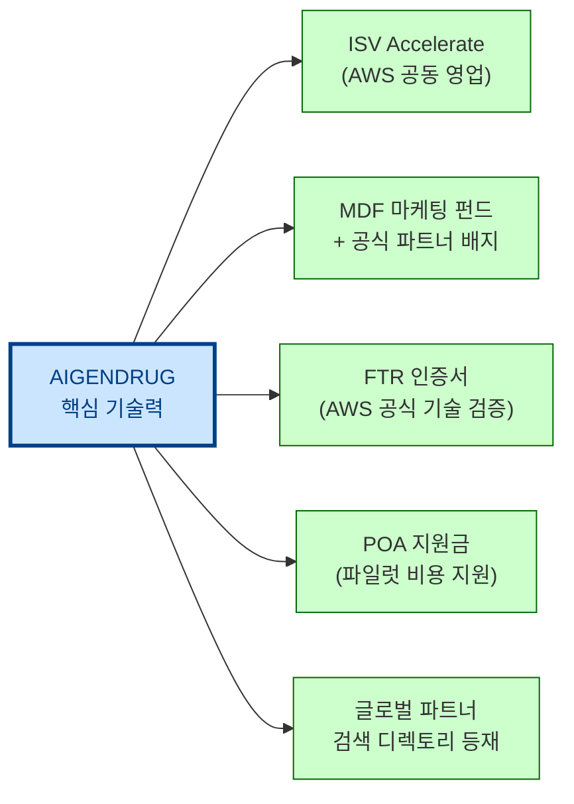
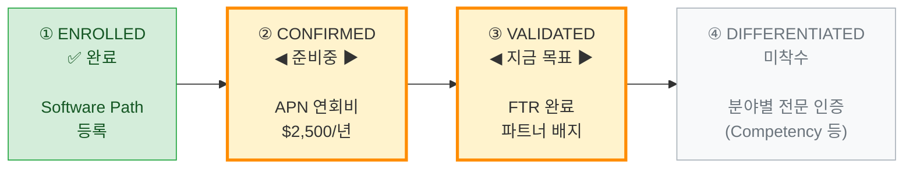
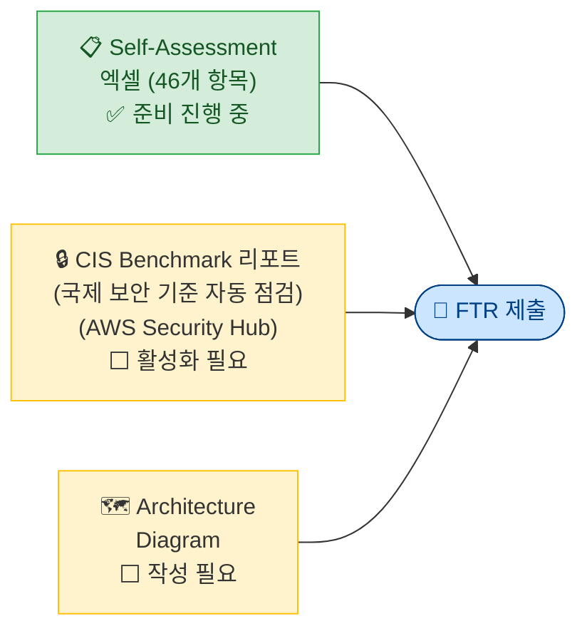
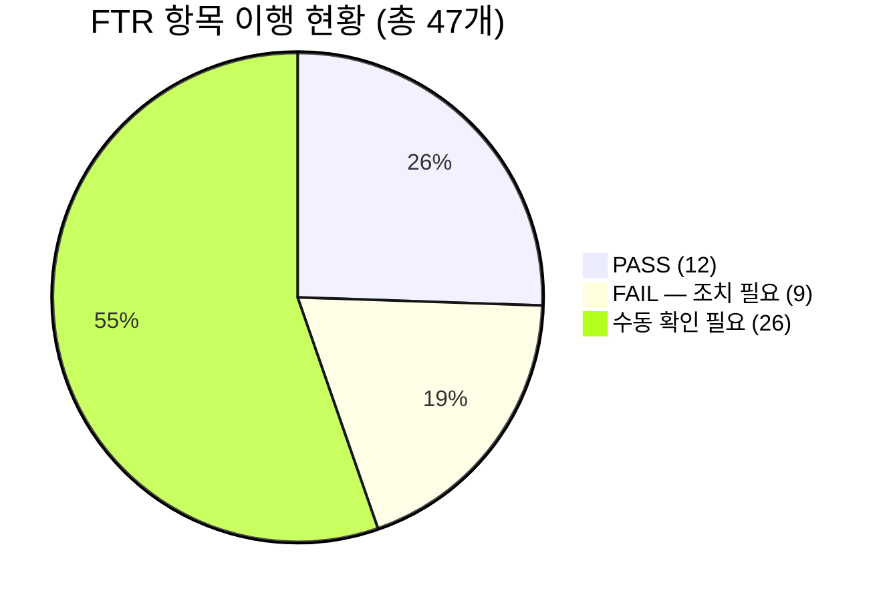
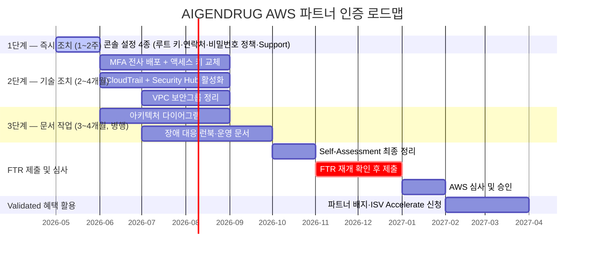

# AWS 파트너 인증 전략 로드맵

> **대상**: AIGENDRUG Co., Ltd.  
> **작성일**: 2026년 5월  
> **현재 단계**: Enrolled 완료 → **Validated(FTR; Foundational Technical Review, 기술 기반 공식 검토) self-test 진행중**  

---

## 왜 AWS 파트너 인증이 필요한가?

AWS 공식 파트너 인증(Validated)을 취득하면 단순한 "배지" 이상의 **영업·사업 구조적 이점**이 생깁니다.

### 핵심 비즈니스 이유 3가지

| # | 이유 | 설명 |
|---|---|---|
| 1 | **AWS가 우리 제품을 대신 팔아준다** | AWS 영업 담당자(AM; Account Manager, 고객사 전담 영업)가 고객에게 AIGENDRUG 솔루션을 직접 추천. AWS 고객 접점을 우리 영업 채널로 활용 |
| 2 | **글로벌 검색에 공식 노출된다** | AWS.com 파트너 검색 디렉토리(Partner Solution Finder)에 등재 → 전 세계 기업 고객이 AWS 파트너를 검색할 때 AIGENDRUG이 보임 |
| 3 | **기술 신뢰도가 공식 인증된다** | AWS FTR(Foundational Technical Review)은 보안·안정성·운영 표준을 검증하는 기술 심사. 대기업·제약사 고객 납품 시 "AWS 인증 파트너" 레퍼런스가 계약 장벽을 낮춤 |

---

## AWS 인증이 AIGENDRUG의 기술력을 사업 성과로 연결하는 방법

> AIGENDRUG의 핵심 경쟁력은 **기술과 연구**에 있습니다.
> AWS 파트너 인증은 이 기술력을 글로벌 시장에서 영업·마케팅·신뢰도로 전환해주는 **외부 인프라**입니다.
> 내부 자원을 연구·개발에 집중한 채로, 사업화에 필요한 나머지를 AWS 생태계가 채워줍니다.

### ① 기술력을 영업 채널로 전환

우수한 기술을 보유하고 있어도, 적합한 고객을 만나는 데는 별도의 경로가 필요합니다.
AWS 인증은 전 세계 AWS 영업 담당자(AM; Account Manager)들이 AIGENDRUG를 고객에게 직접 소개하는 구조를 만들어줍니다.

| AWS가 제공하는 것 | 효과 |
|---|---|
| ISV Accelerate (공동 영업 프로그램) — AWS 영업 담당자가 맞춤 견적을 고객에게 직접 제안 | 인증 파트너의 51%가 매출 성장, 65%가 더 빠른 계약 체결 경험 |
| 파트너 검색 디렉토리(Partner Solution Finder) 등재 — AWS.com에서 전 세계 고객이 검색 가능 | 별도 마케팅 비용 없이 글로벌 노출 |
| AWS 영업 담당자 인센티브 구조 | 담당자가 AIGENDRUG를 **적극적으로 추천할 동기** 생김 |

* ISV - Independent Software Vendor  

---

### ② 기술 신뢰도를 공식 인증으로 가시화

기술이 아무리 뛰어나도, 대기업·글로벌 제약사와 거래하려면 **제3자의 공식 검증**이 필요합니다.
FTR 인증은 AWS가 직접 발행하는 기술 신뢰도 증명서 역할을 합니다.

| AWS가 제공하는 것 | 효과 |
|---|---|
| FTR(Foundational Technical Review) 인증서 — 보안·안정성 46개 항목 통과 증명 | 글로벌 제약사 협력사 등록 시 ISO/SOC 국제 인증 대신 활용 가능 |
| "AWS Validated Partner" 공식 지위 | 대기업 고객의 벤더 심사 장벽을 낮춤 |
| AWS Partner Badge (공식 인증 마크) | 제안서·웹사이트에 표시 → 초기 신뢰 형성 가속 |

---

### ③ 마케팅·사업 확장 비용을 AWS와 분담

연구·개발에 집중하는 만큼, AWS가 마케팅과 사업 확장 비용 일부를 직접 지원합니다.

| AWS가 제공하는 것 | 효과 |
|---|---|
| MDF(Marketing Development Funds; 마케팅 개발 펀드) — 콘텐츠 제작, 웨비나, 이벤트 비용 지원 | 자체 마케팅 예산 절감 |
| POA 지원금(Partner Opportunity Acceleration; 파트너 기회 가속 지원금) — 파일럿 테스트(PoC) 비용 지원 | 대형 계약 진입 비용 부담 경감 |
| AWS 공식 블로그·보도자료 공동 발행 | AWS 브랜드와 함께 기술력 대외 홍보 |
| AWS Global Sponsorship — re:Invent 등 글로벌 행사 참여 경로 | 글로벌 네트워킹 및 브랜드 노출 |

---

### 요약

> **결론**: AWS 인증은 AIGENDRUG의 기술력을 그대로 유지하면서, 영업·마케팅·신뢰도라는 사업화 인프라를 외부에서 추가하는 전략입니다.
> 연구·개발 투자를 줄이지 않고도 글로벌 시장 접근이 가능해집니다.

---

## 전체 단계 한눈에 보기

---

## STAGE 3 — Validated 취득이 가져오는 것

> 현재 플랫폼팀의 **최우선 목표**입니다.

### FTR(Foundational Technical Review; AWS 기술 기반 공식 검토)이란?

AWS가 파트너의 솔루션을 직접 기술 심사하는 공식 검증 절차입니다.
보안, 안정성, 운영 자동화 등 **46개 항목**을 검토하며, 통과 시 "AWS Validated Partner" 지위를 획득합니다.

### FTR 제출 서류 3종

### Validated 취득 즉시 열리는 혜택

| 혜택 | 프로그램 | 효과 |
|---|---|---|
| 영업 채널 확대 | ISV Accelerate (공동 영업 프로그램) | AWS 영업팀이 AIGENDRUG를 고객에게 추천 → 파트너 51% 매출 성장, 65% 빠른 계약 |
| 글로벌 파트너 디렉토리 | Solution Finder (파트너 검색 디렉토리) 등재 | AWS.com에서 잠재 고객이 AIGENDRUG 검색 → 별도 마케팅 비용 없이 글로벌 노출 |
| 공식 파트너 배지 | AWS Partner Badge (인증 마크) | 웹사이트·제안서에 AWS 인증 마크 → 대기업 고객 신뢰도 제고 |
| 파일럿 테스트 자금 지원 | POA Funding (파트너 기회 가속 지원금) | 파일럿 테스트·마케팅 비용 AWS 지원 → 대형 계약 추진 시 비용 부담 경감 |

---

## 비용 대비 효과 요약

| 항목 | 비용/부담 | 기대 효과 |
|---|---|---|
| APN(AWS 파트너 네트워크) 연회비 | $2,500 / 년 | 납부 필요 |
| FTR 준비 | 플랫폼 인력 3명 × 약 6개월 (기존 업무 병행) | AWS 영업 채널 개방, 공식 배지 취득 |
| CIS 리포트 생성 | Security Hub(보안 모니터링 서비스) 활성화 (~$100/월) | 보안 모니터링 체계 구축 병행 |
| Business Support 구독 | 월 $100~ (사용료 규모에 따라 변동) | FTR 필수 요건 + AWS 기술 지원 채널 확보 |

> FTR은 **일회성 심사**입니다. 취득 후에는 별도 갱신 없이 혜택이 유지됩니다 (솔루션 큰 변경 시 재심사).

---

## 현재 준비 상태

> 기준: FTR 통합 리포트 2026-04-29 (IaC 코드 자동 검증 + AWS 콘솔 자동 점검 병합)

**❌ 조치 필요한 9개 항목 (기존 업무 병행 기준 난이도 포함):**

| # | 항목 | 내용 | 예상 소요 |
|---|---|---|---|
| ① | 루트 액세스 키 삭제 | 루트 계정에 액세스 키 1개 존재 — IAM 콘솔에서 즉시 삭제 | 1일 |
| ② | AWS 계정 연락처 3종 설정 | 청구·운영·보안 담당자 연락처 미설정 | 1일 |
| ③ | IAM 비밀번호 정책 설정 | 비밀번호 정책 미설정 — 14자 이상, 재사용 방지 설정 필요 | 1일 |
| ④ | AWS Business Support 구독 | 현재 Basic 플랜 — Business 이상 업그레이드 필요 (월 $100~) | 1일 (결재 포함) |
| ⑤ | IAM 사용자 MFA(2단계 로그인) 설정 | MFA 미설정 사용자 5명 — 해당 인원 개별 설정 필요 | 1~2주 (전사 협조 필요) |
| ⑥ | IAM 액세스 키 90일 주기 교체 | 90일 초과 키 8개 — 일부 1,000일 이상 미교체. 키 교체 시 서비스 영향도 확인 필수 | 2~4주 (서비스 영향 검토 포함) |
| ⑦ | 기본 VPC(가상 네트워크) 보안그룹 잠금 | 규칙 있는 기본 보안그룹 3개 — 규칙 제거 전 실제 사용 여부 검토 필요 | 2~4주 (영향도 분석 포함) |
| ⑧ | CloudTrail(계정 활동 기록) 활성화 | 현재 trail 없음 — 인프라 코드(Terraform)로 전 리전 적용 | 2~4주 |
| ⑨ | AWS Security Hub + CIS Benchmark 활성화 및 리포트 생성 | 활성화 후 기준 미달 항목 추가 대응 필요 — 리포트 생성까지 수주 소요 | 4~8주 (후속 조치 포함) |

> ⚠️ 특히 ⑥ 액세스 키 교체와 ⑦ 보안그룹 변경은 **운영 중인 서비스에 영향을 줄 수 있어** 사전 영향도 분석과 단계적 적용이 필요합니다.

**수동 확인 필요 26개 항목**은 기술 조치 외에 **문서 작성이 필요한 항목들**이 다수 포함되어 있습니다:
- 장애 대응 런북(RPO/RTO 수치 포함)
- 아키텍처 다이어그램
- 취약점 관리 프로세스 문서
- 온보딩·오프보딩 절차 문서
- 서비스 SLA(서비스 수준 약정) 문서 등

**✅ 이미 통과한 12개 항목 (주요 항목):**

| 항목 | 내용 |
|---|---|
| 루트 계정 MFA | 활성화 완료 |
| 보안그룹 최소 권한 | 전체 개방 인바운드 없음, 운영 환경 SSH 비활성화 |
| 자동 백업 구성 | DynamoDB 자동 백업, S3 버전 관리 설정 |
| 저장 데이터 암호화 | S3·DynamoDB KMS 암호화 적용 |
| 전송 중 암호화(TLS) | 인증서 + 로드밸런서, S3 HTTPS 전용 정책 |
| 코드에 자격증명 하드코딩 없음 | 확인 완료 |
| 시크릿 보안 저장소 관리 | Secrets Manager 적용 완료 |
| 멀티-AZ(다중 가용 영역) 아키텍처 | 4개 AZ + 로드밸런서 구성 완료 |

---

## 권장 타임라인

> 기준: 플랫폼 인력 3명, 기존 업무 병행. FTR은 현재 Paused 상태로 재개 시점에 맞춰 제출 준비.

> **목표 일정: 착수 후 약 9개월, 2027년 1~2월 FTR 승인**

---

## STAGE 4 — 미래 전략 (Differentiated)

Validated 취득 이후 AIGENDRUG에 적합한 방향:

| 프로그램 | 내용 | AIGENDRUG 적합도 |
|---|---|---|
| **AWS AI/ML Competency** | 인공지능·머신러닝 솔루션 분야 최고 등급 전문성 인증 | ★★★ 매우 높음 |
| **AWS Life Sciences Competency** | 생명과학·신약 개발 분야 전문성 인증 | ★★★ 매우 높음 |
| **AWS Healthcare Competency** | 의료·헬스케어 분야 전문성 인증 | ★★ 높음 |
| AWS Service Ready | 특정 AWS 서비스와의 통합·호환성 인증 | ★ 검토 필요 |
| AWS WAPP (Well-Architected 파트너 프로그램) | 고객 인프라 품질 진단 서비스 수행 능력 인증 | ★ 검토 필요 |

> Competency(전문성 인증) 취득 시 AWS.com 검색 우선 노출, 확정 MDF 마케팅 펀드, AWS 공식 블로그 등재 등 추가 혜택.

---

## 참고: 상세 문서

| 문서 | 내용 |
|---|---|
| [FTR_상세_절차.md](./FTR_상세_절차.md) | FTR 46개 항목별 이행 방법 |
| [IaC_검증_가이드.md](./IaC_검증_가이드.md) | 자동 검증 도구 실행 방법 |
| [IaC_검증_리포트_2026-04-29.md](./IaC_검증_리포트_2026-04-29.md) | 최신 검증 결과 (23 PASS) |
| [DrugVLAB_AWS_전략_로드맵.md](./DrugVLAB_AWS_전략_로드맵.md) | AIGENDRUG 관점 상세 전략 |

---

## 주요 링크

| 프로그램 | URL |
|---|---|
| FTR 공식 | https://aws.amazon.com/ko/partners/foundational-technical-review/ |
| ISV Accelerate | https://aws.amazon.com/partners/programs/isv-accelerate/ |
| Partner Solution Finder | https://partners.amazonaws.com/ |
| AWS Competency | https://aws.amazon.com/partners/offerings/ |
| Badge Manager | https://partnercentral.awspartner.com/Badge_Manager |
