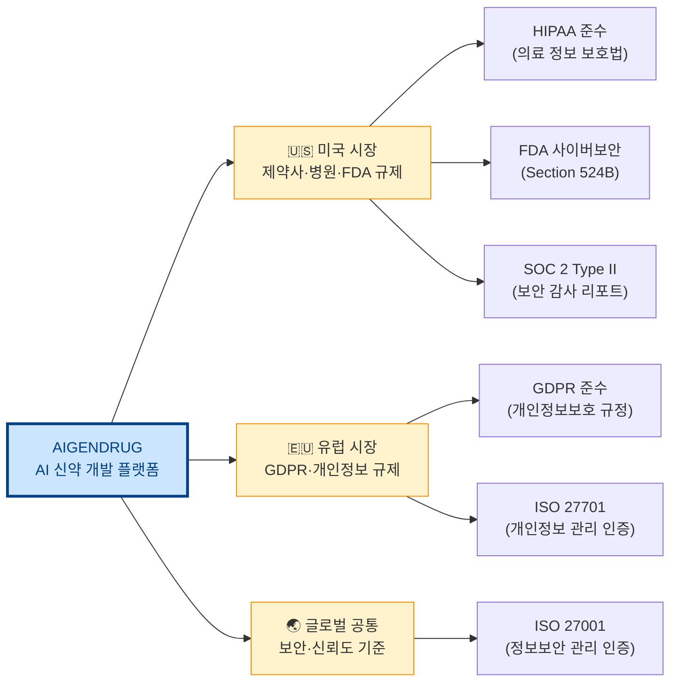
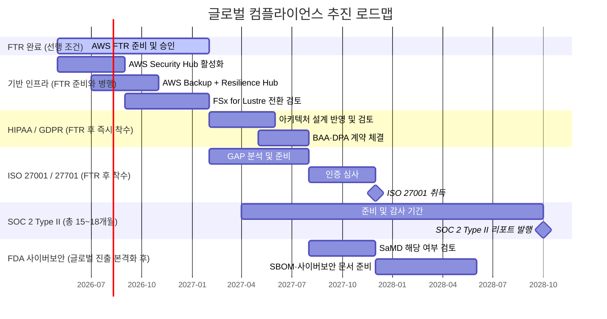
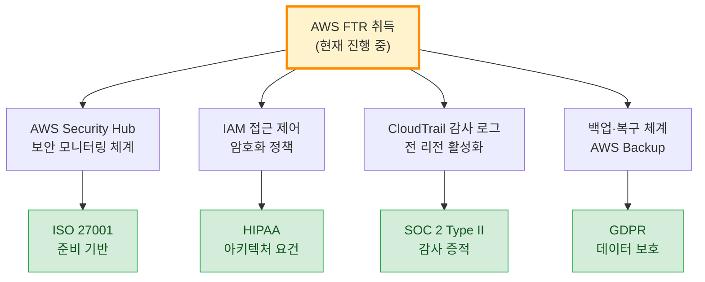

# 글로벌 시장 진출을 위한 컴플라이언스 및 기술 로드맵

> **대상**: AIGENDRUG Co., Ltd. 경영진 보고용
> **작성일**: 2026년 5월
> **목적**: 신약 개발·헬스케어 AI 플랫폼의 글로벌(미국·유럽) 시장 진출에 필요한 인증·규제 대응 전략

---

## 왜 컴플라이언스가 사업의 전제 조건인가

신약 개발·헬스케어 AI 분야는 **환자 데이터와 의료 정보를 다루는 특성상**, 일반 소프트웨어와 달리 글로벌 시장 진입 자체가 규제 준수 여부에 달려 있습니다.
계약 협상 이전에 벤더 심사 단계에서 인증 보유 여부를 확인하는 것이 업계 표준입니다.

---

## 인증별 상세 설명

### ISO 27001 — 글로벌 진출의 기본 전제

> **한 줄 요약**: "우리 회사는 정보보안을 체계적으로 관리한다"는 국제 공인 증명서

- **발급 기관**: ISO (국제표준화기구), 제3자 인증 심사 기관
- **필요한 이유**: 글로벌 제약사·바이오텍과 계약 시 벤더 심사 필수 항목. 미국·유럽·일본 모두 통용
- **유효 기간**: 3년 (매년 사후 심사)
- **소요 기간**: 준비 6~12개월 + 심사 2~3개월
- **AWS와의 연계**: AWS 인프라 자체는 ISO 27001 인증 보유 → AIGENDRUG 플랫폼 레이어만 추가 준비하면 됨
- **우선순위**: ★★★ 가장 먼저 착수 권장

---

### ISO 27701 — 개인정보 관리 체계 인증

> **한 줄 요약**: ISO 27001의 확장판. "개인정보를 어떻게 수집·보관·활용·파기하는지" 체계 인증

- **필요한 이유**: 환자 유전체 데이터, 임상 데이터 등 민감한 개인정보를 다루는 AIGENDRUG의 특성상 필수
- **GDPR과의 관계**: ISO 27701 취득 시 GDPR 준수 체계의 핵심 증거로 활용 가능 — 중복 작업 최소화
- **소요 기간**: ISO 27001과 동시 추진 시 추가 3~6개월
- **우선순위**: ★★★ ISO 27001과 함께 추진

---

### GDPR — 유럽 시장 진출의 법적 요건

> **한 줄 요약**: EU(유럽연합) 시민의 개인정보를 다루는 모든 기업에 적용되는 규정. 위반 시 전 세계 매출의 최대 4% 과징금

- **적용 범위**: EU 거주자의 데이터를 처리하는 기업 — 유럽에 서버가 없어도 적용됨
- **AIGENDRUG 관련**: 유럽 제약사·연구기관과 협업 시, 또는 유럽 환자 데이터를 포함한 임상 데이터 처리 시 즉시 적용
- **핵심 요구사항**:
  - 개인정보 처리 목적 명시 및 동의 체계
  - 데이터 이동권·삭제권 보장
  - 개인정보 유출 72시간 내 신고 의무
  - DPA(데이터 처리 계약서) 체결
- **AWS와의 연계**: AWS는 GDPR 준수 인프라 제공 + 표준 계약 조항(SCC) 제공 → 인프라 레이어는 해결됨
- **우선순위**: ★★★ 유럽 파트너십 논의 전 반드시 준비

---

### FDA 사이버보안 Section 524B — 미국 의료기기 소프트웨어 규제

> **한 줄 요약**: 미국 FDA(식품의약국)가 의료기기 소프트웨어에 요구하는 사이버보안 의무 사항. 2023년 발효

- **적용 범위**: 미국 FDA 허가가 필요한 의료기기 소프트웨어(SaMD; Software as a Medical Device)
- **AIGENDRUG 관련**: AI 신약 개발 플랫폼이 FDA 허가 경로를 밟을 경우 필수. 미국 제약사 파트너십 시 신뢰도 요소
- **핵심 요구사항**:
  - 사이버보안 설계 문서 제출
  - 소프트웨어 자재 명세서(SBOM; Software Bill of Materials) 제출
  - 취약점 모니터링 및 패치 계획 수립
  - 사후 시장 사이버보안 유지 계획
- **우선순위**: ★★ FDA 허가 경로 확정 후 착수
- **컨설팅**: AWS 헬스케어·생명과학 전문 파트너를 통한 SOT(특화 기술 지원) 컨설팅 활용 가능

---

### SOC 2 Type II — 미국 시장 실사(Due Diligence) 대응

> **한 줄 요약**: 미국 기업들이 벤더 계약 전 요구하는 보안·가용성·기밀성 감사 리포트. 6~12개월 실제 운영 기간을 감사

- **Type I vs Type II 차이**:
  - Type I: 특정 시점의 보안 통제 설계 확인 (3~6개월 소요)
  - Type II: 6~12개월 실제 운영 결과 감사 → 미국 대형 고객이 요구하는 것은 대부분 **Type II**
- **필요한 이유**: 미국 제약사·바이오텍·병원 시스템과 계약 시 실사(Due Diligence) 필수 제출 자료
- **AWS와의 연계**: AWS 인프라 레이어는 SOC 2 인증 보유 → AIGENDRUG 애플리케이션 레이어만 감사 범위에 포함
- **소요 기간**: 준비 3~6개월 + 감사 기간 6~12개월 (총 9~18개월)
- **우선순위**: ★★★ 미국 시장 목표 시점 기준으로 역산하여 즉시 착수 권장

---

### HIPAA — 미국 의료 정보 보호 아키텍처 필수 적용

> **한 줄 요약**: 미국 환자 의료 정보(PHI; Protected Health Information, 보호 대상 의료 정보)를 다루는 모든 시스템에 적용되는 연방법

- **적용 범위**: 미국 환자의 의료 기록, 유전 정보, 임상 데이터를 처리·저장·전송하는 모든 시스템
- **AIGENDRUG 관련**: 미국 병원·제약사와 임상 데이터 연동 시 즉시 적용. 위반 시 건당 최대 $1.9M 벌금
- **핵심 아키텍처 요구사항**:
  - 저장 데이터 암호화 (AES-256)
  - 전송 데이터 암호화 (TLS 1.2 이상)
  - 접근 제어 및 감사 로그 전체 보관
  - 비즈니스 제휴 계약(BAA; Business Associate Agreement) 체결
- **AWS와의 연계**: AWS는 HIPAA 준수 서비스 목록을 공식 제공하며 BAA 체결 가능 → **AWS 기반 아키텍처가 HIPAA 준수에 유리**
- **우선순위**: ★★★ 미국 임상 데이터 연동 전 반드시 아키텍처 설계에 반영

---

## AWS 기술 인프라 — 컴플라이언스를 지원하는 핵심 서비스

> 위 인증들은 아키텍처 설계 단계부터 반영해야 소급 비용이 줄어듭니다.
> 아래 AWS 서비스들은 컴플라이언스 요건을 인프라 레벨에서 충족하기 위한 구성 요소입니다.

### 보안 모니터링 — AWS Security Hub

> 전체 AWS 계정의 보안 상태를 한 곳에서 자동 점검하는 서비스

- ISO 27001, HIPAA, SOC 2, CIS Benchmark 기준을 자동으로 점검하고 위반 항목 알림
- FTR 제출용 CIS Benchmark 리포트 자동 생성
- **도입 효과**: 감사(Audit) 준비 시간 대폭 단축, 수동 점검 불필요

---

### 백업 및 복구 — AWS Backup

> 전체 AWS 리소스의 백업을 중앙에서 자동 관리하는 서비스

- HIPAA, ISO 27001이 요구하는 데이터 백업·복구 정책 자동 적용
- 백업 보관 기간, 암호화, 접근 제어를 정책으로 일괄 관리
- **도입 효과**: 컴플라이언스 감사 시 백업 정책 증빙 자료 자동 생성

---

### 복원력(장애 대응) 관리 — AWS Resilience Hub

> 시스템 장애 발생 시 얼마나 빨리 복구할 수 있는지 목표치(RTO/RPO)를 설정하고 자동으로 검증하는 서비스

- **RTO(Recovery Time Objective)**: 장애 발생 후 서비스 복구까지 허용 시간
- **RPO(Recovery Point Objective)**: 장애 발생 시 허용 가능한 데이터 손실 시간
- FDA, HIPAA, ISO 27001 모두 복구 목표치 문서화를 요구
- **도입 효과**: 감사 제출용 복원력 리포트 자동 생성, 장애 시나리오 사전 시뮬레이션

---

### 대용량 신약 데이터 처리 — Amazon FSx for Lustre

> 신약 개발에서 발생하는 대규모 데이터(유전체·단백질 구조·시뮬레이션 결과)를 빠르게 처리하기 위한 고성능 파일 시스템

- **현재 문제**: 일반 파일 시스템(EFS 등)은 대량 동시 읽기 성능에 한계가 있고 입출력(I/O) 비용이 급증
- **FSx for Lustre의 장점**:
  - I/O 비용 없이 대량 동시 읽기에 최적화
  - 분자 동역학 시뮬레이션, 유전체 분석 등 HPC(고성능 컴퓨팅) 워크로드에 특화
  - S3(AWS 오브젝트 스토리지)와 자동 연동
- **전환 권장**: 기존 EFS → Amazon FSx for Lustre

---

### AI 신약 개발 가속 — Amazon Nova

> AWS의 최신 멀티모달(텍스트·이미지·영상 처리 가능) AI 모델

- 신약 후보 물질 스크리닝, 문헌 분석, 임상 데이터 요약 등 신약 개발 전 과정에 적용 가능
- AWS 인프라 내에서 실행 → HIPAA·GDPR 준수 환경에서 데이터를 외부로 내보내지 않고 AI 활용 가능
- **기존 외부 AI 모델 대비 장점**: 데이터가 AWS 계정 밖으로 나가지 않아 컴플라이언스 리스크 없음

---

## 추진 일정 및 우선순위

---

## 인증별 비용·기간·우선순위 한눈에 보기

| 인증 | 목표 시장 | 소요 기간 | 준비 비용 (추정) | 우선순위 |
|---|---|---|---|---|
| **ISO 27001** | 글로벌 공통 | 9~15개월 | 3,000~8,000만 원 | ★★★ 즉시 착수 |
| **ISO 27701** | 글로벌 공통 | +3~6개월 (ISO 27001과 병행) | +1,000~2,000만 원 | ★★★ ISO 27001과 병행 |
| **GDPR 체계 구축** | 유럽 | 3~6개월 | 1,000~3,000만 원 | ★★★ 유럽 협의 전 |
| **SOC 2 Type II** | 미국 | 15~18개월 | 5,000~1억 원 | ★★★ 즉시 착수 권장 |
| **HIPAA 아키텍처** | 미국 | 3~6개월 | 설계 변경 비용 | ★★★ 지금 설계에 반영 |
| **FDA Section 524B** | 미국 (SaMD) | SaMD 경로 확정 후 | 별도 산정 | ★★ 경로 확정 후 |

> **핵심 원칙**: HIPAA와 GDPR은 인증이 아니라 **아키텍처 설계 요건**입니다. 나중에 소급 적용하면 재개발 비용이 발생하므로, 지금 설계 단계에서 반영하는 것이 가장 경제적입니다.

---

## AWS 파트너 프로그램 연계 — APN Fastback Academy

> AWS 파트너 중 성장 잠재력이 높은 스타트업·신흥 기업을 선발해 빠른 성장을 지원하는 AWS 공식 프로그램

- **지원 내용**:
  - AWS 전문가 1:1 기술 멘토링
  - 컴플라이언스·보안 아키텍처 설계 지원
  - 파트너 네트워크 및 공동 영업 기회 연결
  - AWS 크레딧 및 펀딩 지원
- **신청 조건**: AWS Partner Network 등록 + 성장 지표 충족
- **AIGENDRUG 활용 방안**: ISO 27001·HIPAA·GDPR 준비 과정에서 AWS 전문가 지원을 무상으로 받을 수 있는 경로

---

## AWS와 FTR의 관계 — 컴플라이언스 준비의 출발점

현재 진행 중인 **AWS FTR(기술 기반 공식 검토)** 은 위 모든 인증의 공통 기반입니다.

> FTR을 통해 구축하는 보안 인프라는 ISO 27001·HIPAA·SOC 2·GDPR 준비의 실질적인 첫 단계입니다.
> **지금 FTR을 준비하는 것이 곧 글로벌 컴플라이언스 준비의 시작**입니다.

---

## 참고 문서

| 문서 | 내용 |
|---|---|
| [AWS_파트너_전체_로드맵.md](./AWS_파트너_전체_로드맵.md) | AWS Software Partner Path 및 FTR 취득 전략 |
| [FTR_상세_절차.md](./FTR_상세_절차.md) | FTR 46개 항목별 이행 방법 |
| [IaC_검증_리포트_2026-04-29.md](./IaC_검증_리포트_2026-04-29.md) | 현재 인프라 보안 검증 결과 |
