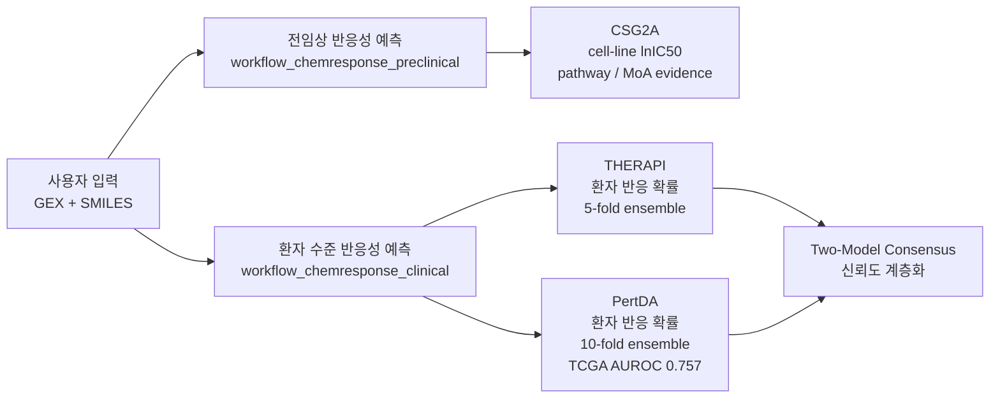
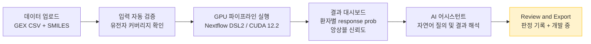
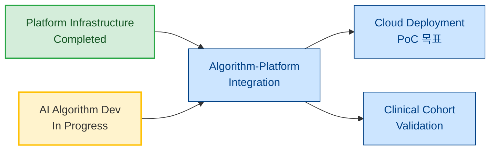
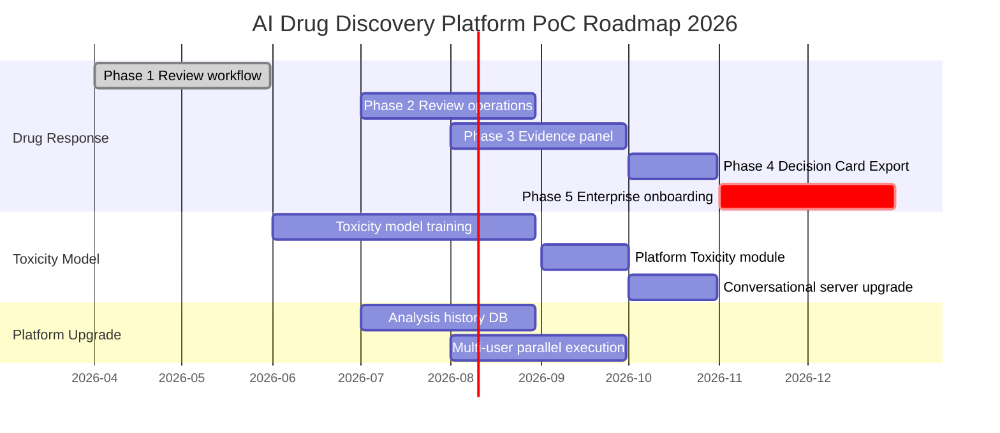

# AI 신약 발견 플랫폼 개발 진척도 보고서

> **작성일:** 2026-05-21  
> **대상:** 산업통상자원부 과제 총괄 보고 (상반기 AI 제품 개발 진척도)  
> **작성:** 플랫폼팀

---

## 1. 개요

본 과제 플랫폼팀은 AI 기반 신약 발견 통합 플랫폼의 핵심 인프라 구축을 상반기 목표로 개발을 진행하였습니다.

현재 플랫폼은 **기존(legacy) 알고리즘** 기반으로 기능 구조를 완성한 상태이며, 과제 내 AI팀에서 개발 중인 **Drug Response 예측 모델(THERAPI/PREDIKTOR)** 및 **Toxicity 예측 모델**이 완성되는 시점에 플랫폼에 순차 연동할 계획입니다.

---

## 2. 상반기 대표 성과

### 2-1. AACR 2025 발표 및 Drug Response 예측 모듈 제품화 (AI팀 성과)

> **"Deep Learning Frameworks for Translating Cancer Drug Response from Cell-level to Patient-Level by Modeling Transcriptome"**  
> Sun Kim, Dongmin Bang, Bonil Koo, Inyoung Sung, Changyun Cho (Seoul National University / AIGENDRUG Co. Ltd.)  
> Sangseon Lee (Inha University), Kyoung-Jae Won (Cedars Sinai Medical Center)

#### 운영 중인 약물 반응성 워크플로우

| 워크플로우 | 입력 | 핵심 모델 | 출력 |
|---|---|---|---|
| 전임상 반응성 | Drug SMILES | CSG2A | cell-line panel lnIC50 + pathway perturbation + MoA similarity |
| 임상(환자) 반응성 | 환자 GEX + Drug SMILES | THERAPI + PertDA | 환자 개인별 반응 확률 + 앙상블 신뢰도 |

#### 핵심 성과 — PertDA 모델

> **cell-line에서 잘 되던 약이 환자에게 안 된다는 translational failure 문제를 모델 아키텍처 레벨에서 직접 해결**

| 기술 요소 | 해결하는 문제 |
|---|---|
| CSG2A 결합 | 약물이 환자 유전자를 실제로 어떻게 바꾸는지 반영 |
| Domain Adaptation (적대적 학습) | GDSC(전임상)와 TCGA(환자) 간 분포 갭을 모델 학습 단계에서 직접 해소 |
| 10-fold ensemble | 예측 불확실성 정량화 |

**검증 성능:**

| 지표 | 수치 |
|---|---|
| TCGA 외부 검증 AUROC | **0.757** (±0.032) |
| 학습 데이터 | GDSC (cell-line, 전임상) |
| 검증 데이터 | TCGA (환자, 임상) — 완전히 독립된 외부 코호트 |
| 앙상블 | 10-fold |

#### Two-Model Consensus — 계층적 신뢰도 프레임워크

THERAPI와 PertDA를 동시에 실행하여 두 독립 모델의 동의 여부로 신뢰도를 계층화한다.

| Tier | 조건 | 의미 | 권장 액션 |
|---|---|---|---|
| **Tier 1** | THERAPI + PertDA 모두 Responder | Consensus Responder — 최고신뢰 | 임상시험 등록 우선 검토 |
| **Tier 2** | 모두 Non-Responder | Consensus Non-Responder | 후보 제외 또는 후순위 |
| **Tier 3** | 불일치 | 모델 간 의견 불일치 | 바이오마커 추가 검토 후 판단 |

#### end-to-end 제품화 현황

**활용 근거 모델:**
- Geneformer (Nature 2024) — rank 기반 전사체 변화 사전학습 모델
- DysRegNet (British Journal of Pharmacology 2024) — 환자 전사체 네트워크 기반 표현

---

### 2-2. AI 신약 발견 플랫폼 기반 인프라 구축 완료 (플랫폼팀 성과)

#### 상반기 구현 완료 기능

| 카테고리 | 기능 | 상태 |
|----------|------|------|
| **웹 플랫폼** | 사용자 인증, WorkSpace 관리, Workflow 실행/중단/재시작, 결과 시각화(3D), CSV 내보내기 | 완료 |
| **대화형 분석 서버** | 자연어 SMILES 입력 → 실시간 WebSocket 분석 스트리밍 → 후속 질의 대화 | 완료 |
| **Nextflow 파이프라인 연동** | 9-step ChemGen 워크플로우 webhook 수신 → 실시간 UI 반영 | 완료 |
| **Drug Response 모듈** | THERAPI/PREDIKTOR 연동 (Preclinical/Clinical Step) | 개발 중 |
| **Toxicity 모듈** | 자체 독성 예측 AI 모델 탑재 | 개발 중 |

---

## 3. 현황 요약 및 포지셔닝

---

## 4. 향후 개발 계획

### 4-1. Drug Response 하반기 개발 계획

| Phase | 시기 | 목표 | 의미 |
|---|---|---|---|
| Phase 1 | ~2026-06 | Review workflow 완성 (판정 저장·이력 조회) | 파일럿 고객 PoC 가능 상태 전환 |
| Phase 2 | 7–8월 | Review 운영 화면 (Pending 목록 / Decision History) | reviewer 일상 업무 흐름 시스템화 |
| Phase 3 | 8–10월 | Evidence/Context 패널 — Recommendation Card + MoA 근거 통합 | 분석 결과 → 검토 가능한 근거 패키지 전환 |
| Phase 4 | 10–11월 | Decision Card Export (JSON → PDF) | 회의 자료 1클릭 생성 |
| Phase 5 | 11–12월 | 첫 enterprise 고객 온보딩 | 실질 매출 전환점 |

### 4-2. Toxicity 모델 탑재 계획

| 항목 | 내용 |
|---|---|
| 현재 상태 | 모델 학습 진행 중 |
| 탑재 목표 | 2026년 하반기 플랫폼 연동 |
| 탑재 효과 | 대화형 분석 서버 독성 예측 고도화, Drug Response와 연계한 종합 안전성 판단 |

### 4-3. 개발 로드맵 (PoC 완성 목표: 2026년 말)

### 4-4. 부족한 부분 및 대응 방안

| 현재 한계 | 현황 | 대응 방안 |
|-----------|------|-----------|
| Review workflow 미완성 | Phase 1 개발 중 | 상반기 내 완료 → 즉시 파일럿 고객 PoC 가능 상태 전환 |
| 외부 코호트 검증 단일 | TCGA만 검증 완료 | 하반기 추가 코호트(METABRIC, ICGC) 적용으로 일반화 근거 보강 |
| Toxicity 모델 미탑재 | 학습 진행 중 | 하반기 플랫폼 연동 완료 목표 |
| 암종 특이적 성능 미검증 | 범암종 모델 기준 | 주요 적응증(유방암·폐암) 특화 검증 착수 계획 |

---

## 5. 총괄 보고용 핵심 메시지

> **상반기 성과 한 줄 요약 (유효성):**  
> "환자 유전자 발현 데이터만으로 개인 수준 약물 반응성을 예측하는 PertDA 모델을 TCGA 외부 검증(AUROC 0.757) 완료하고, GPU 파이프라인·결과 대시보드·AI 어시스턴트까지 포함한 end-to-end 제품으로 배포 운영 중이다."

> **상반기 성과 한 줄 요약 (플랫폼):**  
> "Drug Response 및 Toxicity 모듈 탑재 즉시 통합 운영 가능한 플랫폼 기반 인프라를 완성하였으며, 하반기 PoC 완성을 목표로 개발을 진행 중이다."

**어필 포인트:**

1. **학술 성과 → 제품화 직결** — AACR 발표 모델(PertDA, TCGA AUROC 0.757)이 end-to-end 플랫폼으로 이미 배포 운영 중
2. **translational 문제 직접 해결** — 전임상→임상 도메인 갭을 Domain Adaptation으로 모델 아키텍처 레벨에서 해결한 국내 최초 수준
3. **두 모델 Consensus** — THERAPI + PertDA의 독립 앙상블로 단순 임계값이 아닌 구조적 불확실성 표현
4. **플랫폼 확장성** — Toxicity 모델 완성 즉시 탑재 가능한 모듈형 설계, 하반기 PoC 통합 목표
5. **국제 협력** — 서울대, 인하대, Cedars Sinai 공동 연구 기반의 임상 적용 가능성 확인

---

*본 문서는 AACR Abstract (DRP-978), 플랫폼 개발 코드베이스를 기반으로 작성되었습니다.*
